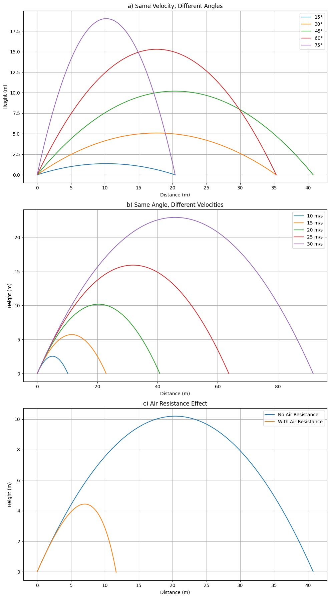

# Problem 1
# Investigating the Range as a Function of the Angle of Projection

## 1. Theoretical Foundation

### 1.1 Equations of Motion

Assuming an idealized system with no air resistance and where the projectile is launched from and lands at the same vertical level, the equations of motion can be derived from Newton’s laws:  

**Horizontal motion (constant velocity):**

$$
x(t) = v_0 \cos(\theta) \cdot t
$$

**Vertical motion (uniform acceleration):**

$$
y(t) = v_0 \sin(\theta) \cdot t - \frac{1}{2}gt^2
$$

Where:

- $v_0$ is the initial velocity  
- $\theta$ is the angle of projection  
- $g$ is the acceleration due to gravity  
- $t$ is time  

### 1.2 Time of Flight

To find the total time of flight $T$, set $y(T) = 0$:

$$
0 = v_0 \sin(\theta) \cdot T - \frac{1}{2}gT^2
$$

Solving for $T$:

$$
T = \frac{2v_0 \sin(\theta)}{g}
$$

### 1.3 Range

Substitute $T$ into the horizontal motion to find the range $R$:

$$
R = v_0 \cos(\theta) \cdot T = v_0 \cos(\theta) \cdot \frac{2v_0 \sin(\theta)}{g}
$$

Using the identity $\sin(2\theta) = 2 \sin(\theta) \cos(\theta)$:

$$
R = \frac{v_0^2 \sin(2\theta)}{g}
$$

This is the key equation describing how the range depends on the angle of projection.

---

## 2. Analysis of the Range

### 2.1 Dependence on Angle

The range is maximized when $\sin(2\theta) = 1$, which occurs at:

$$
\theta = 45^\circ
$$

The graph of $R(\theta)$ is symmetric about $\theta = 45^\circ$, and the same range is achieved by complementary angles (e.g., $30^\circ$ and $60^\circ$).

### 2.2 Influence of Parameters

- **Initial velocity:** Since $R \propto v_0^2$, doubling the initial velocity quadruples the range.
- **Gravitational acceleration:** Since $R \propto \frac{1}{g}$, projectiles travel farther in weaker gravitational fields (e.g., on the Moon).

---

## 3. Practical Applications

### 3.1 Uneven Terrain

If launch and landing heights differ, the equations become more complex. For example, launching from height $h$, the vertical motion becomes:

$$
y(t) = h + v_0 \sin(\theta) \cdot t - \frac{1}{2}gt^2
$$

Solving for the time when $y(t) = 0$ gives a quadratic equation for $t$, and the solution can be used to compute the modified range.

### 3.2 Air Resistance and Wind

In realistic scenarios, air resistance introduces drag forces that depend on velocity (e.g., quadratic drag). These must be solved numerically, often using computational methods such as Euler's method or Runge-Kutta.

---

## 4. Implementation

Below is a Python script that simulates and visualizes the range as a function of projection angle:

```python
import numpy as np
import matplotlib.pyplot as plt

def compute_range(v0, g, angle_deg):
    theta = np.radians(angle_deg)
    return (v0**2 * np.sin(2 * theta)) / g

# Parameters
v0 = 20  # Initial velocity (m/s)
g = 9.81  # Gravitational acceleration (m/s^2)
angles = np.linspace(0, 90, 100)
ranges = compute_range(v0, g, angles)

# Plot
plt.figure(figsize=(10, 6))
plt.plot(angles, ranges)
plt.title('Projectile Range vs Angle of Projection')
plt.xlabel('Angle (degrees)')
plt.ylabel('Range (meters)')
plt.grid(True)
plt.show()

# --- Section 5: Limitations and Extensions ---

# Limitations:
# - The model assumes no air resistance (i.e., vacuum conditions).
# - Launch and landing heights are assumed to be equal.
# - No spin (Magnus effect) or wind is considered.

# Extensions:
# - Add air resistance using a velocity-dependent drag force and solve numerically.
# - Modify equations for projectiles launched from or landing on different elevations.
# - Introduce wind by including horizontal acceleration terms.
```

```python
import numpy as np
import matplotlib.pyplot as plt

# Constants
g = 9.81  # gravity (m/s^2)
angles_deg = [15, 30, 45, 60, 75]  # angles for (a)
velocities = [10, 15, 20, 25, 30]  # velocities for (b)
fixed_velocity = 20
fixed_angle_deg = 45

def compute_trajectory(v0, angle_deg, g=9.81, air_resistance=False, k=0.1, m=1.0):
    theta = np.radians(angle_deg)
    vx0 = v0 * np.cos(theta)
    vy0 = v0 * np.sin(theta)

    if not air_resistance:
        t_flight = 2 * vy0 / g
        t = np.linspace(0, t_flight, 300)
        x = vx0 * t
        y = vy0 * t - 0.5 * g * t**2
    else:
        # Simplified numerical solution using Euler method
        dt = 0.01
        t, x, y = [0], [0], [0]
        vx, vy = vx0, vy0
        while y[-1] >= 0:
            v = np.sqrt(vx**2 + vy**2)
            ax = -k * v * vx / m
            ay = -g - (k * v * vy / m)
            vx += ax * dt
            vy += ay * dt
            x.append(x[-1] + vx * dt)
            y.append(y[-1] + vy * dt)
            t.append(t[-1] + dt)
        t = np.array(t)
        x = np.array(x)
        y = np.array(y)
    return x, y

# Create subplots
fig, axs = plt.subplots(3, 1, figsize=(10, 18))

# a) Same velocity, different angles
for angle in angles_deg:
    x, y = compute_trajectory(fixed_velocity, angle)
    axs[0].plot(x, y, label=f"{angle}°")
axs[0].set_title("a) Same Velocity, Different Angles")
axs[0].set_xlabel("Distance (m)")
axs[0].set_ylabel("Height (m)")
axs[0].legend()
axs[0].grid(True)

# b) Same angle, different velocities
for v in velocities:
    x, y = compute_trajectory(v, fixed_angle_deg)
    axs[1].plot(x, y, label=f"{v} m/s")
axs[1].set_title("b) Same Angle, Different Velocities")
axs[1].set_xlabel("Distance (m)")
axs[1].set_ylabel("Height (m)")
axs[1].legend()
axs[1].grid(True)

# c) With vs Without Air Resistance
x_no_air, y_no_air = compute_trajectory(fixed_velocity, fixed_angle_deg, air_resistance=False)
x_air, y_air = compute_trajectory(fixed_velocity, fixed_angle_deg, air_resistance=True)
axs[2].plot(x_no_air, y_no_air, label="No Air Resistance")
axs[2].plot(x_air, y_air, label="With Air Resistance")
axs[2].set_title("c) Air Resistance Effect")
axs[2].set_xlabel("Distance (m)")
axs[2].set_ylabel("Height (m)")
axs[2].legend()
axs[2].grid(True)

plt.tight_layout()
plt.show()
```




## My Colab (Canliy961)

[Projectile Range vs Angle of Projection](https://colab.research.google.com/drive/1zub6JQdK1DkVS4CyWHUYSn65Y6caYdtk?usp=sharing)

[Air Resistance](https://colab.research.google.com/drive/1-LY1_obgdUI8-Xdt-vc6DoB6PndG1GYe)
