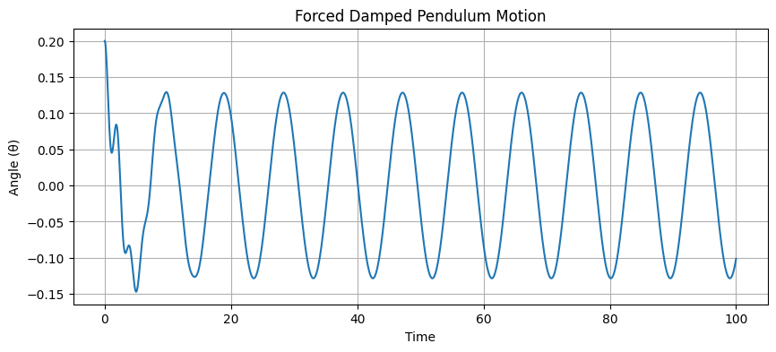
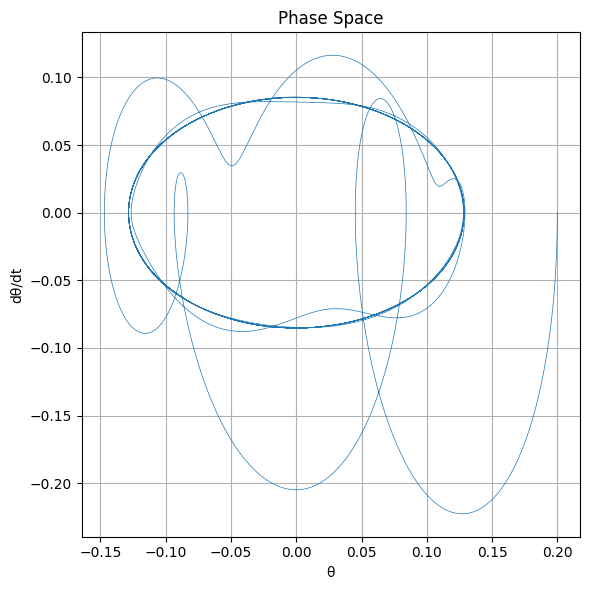

# Problem 2
# Investigating the Dynamics of a Forced Damped Pendulum

## 1. Theoretical Foundation

### 1.1 Governing Equation

The equation of motion for a forced damped pendulum is:

$$
\frac{d^2\theta}{dt^2} + b\frac{d\theta}{dt} + \frac{g}{L}\sin\theta = A\cos(\omega t)
$$

Where:

- $\theta(t)$ is the angular displacement  
- $b$ is the damping coefficient  
- $g$ is gravitational acceleration  
- $L$ is the length of the pendulum  
- $A$ is the amplitude of the driving force  
- $\omega$ is the driving frequency  

---

### 1.2 Small-Angle Approximation

For small angles ($\theta \ll 1$), we approximate $\sin\theta \approx \theta$, reducing the equation to:

$$
\frac{d^2\theta}{dt^2} + b\frac{d\theta}{dt} + \frac{g}{L}\theta = A\cos(\omega t)
$$

This is a linear second-order differential equation describing a damped, driven harmonic oscillator.

---

### 1.3 Resonance

Resonance occurs when the driving frequency $\omega$ matches the natural frequency $\omega_0 = \sqrt{\frac{g}{L}}$. At resonance, the system absorbs energy most efficiently, leading to large oscillations (limited only by damping).

The steady-state amplitude response $\Theta(\omega)$ for the linearized case is:

$$
\Theta(\omega) = \frac{A}{\sqrt{(\omega_0^2 - \omega^2)^2 + (b\omega)^2}}
$$

This curve demonstrates resonance behavior and is important for identifying the critical driving frequency.

---

## 2. Analysis of Dynamics

### 2.1 Parameter Dependence

- **Damping coefficient ($b$):**
  - Controls energy dissipation
  - Low $b$: resonance peak is sharp
  - High $b$: oscillations decay quickly, response is flatter

- **Driving amplitude ($A$):**
  - Larger $A$: stronger external influence
  - Can drive the system into nonlinear or chaotic regimes

- **Driving frequency ($\omega$):**
  - If near $\omega_0$: resonance
  - Away from $\omega_0$: weak or slow oscillations

---

### 2.2 Transition to Chaos

When the small-angle approximation is no longer valid, the equation becomes nonlinear. For certain values of $A$, $\omega$, and $b$, the system exhibits:

- Period doubling  
- Quasiperiodicity  
- Chaotic motion (sensitive dependence on initial conditions)  

To analyze this, phase portraits and Poincaré sections (sampling phase space at intervals of the driving period) are useful.

---

## 3. Practical Applications

The forced damped pendulum is a model for many systems:

- **Energy harvesting:** Mechanical systems coupled to electromagnetic or piezoelectric generators  
- **Suspension bridges:** Dynamic loads (e.g., wind) may cause resonance  
- **Clock mechanisms:** Pendulum dynamics must be stabilized for accurate timekeeping  
- **Oscillating circuits:** Driven RLC circuits act as electrical analogs  
- **Biomechanics:** Human gait and balance involve pendulum-like dynamics under control

---

## 4. Implementation

### 4.1 Python Simulation

```python
import numpy as np
import matplotlib.pyplot as plt
from scipy.integrate import solve_ivp

# Parameters
g = 9.81
L = 1.0
b = 0.5
A = 1.2
omega = 2/3

def pendulum(t, y):
    theta, omega_theta = y
    dtheta_dt = omega_theta
    domega_dt = -b * omega_theta - (g / L) * np.sin(theta) + A * np.cos(omega * t)
    return [dtheta_dt, domega_dt]

# Initial condition
y0 = [0.2, 0.0]

# Time span
t_span = (0, 100)
t_eval = np.linspace(*t_span, 10000)

# Solve
sol = solve_ivp(pendulum, t_span, y0, t_eval=t_eval)

# Plot angular displacement
plt.figure(figsize=(10, 4))
plt.plot(sol.t, sol.y[0])
plt.xlabel('Time')
plt.ylabel('Angle (θ)')
plt.title('Forced Damped Pendulum Motion')
plt.grid(True)
plt.show()
```



### 4.2 Phase Space and Poincaré Section

To investigate chaotic dynamics in the forced damped pendulum, we visualize the motion using:

- **Phase Space:** Plot of $\theta$ vs $\frac{d\theta}{dt}$
- **Poincaré Section:** Discrete samples of the system at each driving period

Let the driving period be:

$$
T = \frac{2\pi}{\omega}
$$

We sample the pendulum state $(\theta, \dot{\theta})$ at times $t = nT$.

```python
# Phase space and Poincaré section for forced damped pendulum

import numpy as np
import matplotlib.pyplot as plt
from scipy.integrate import solve_ivp

# Parameters
g = 9.81
L = 1.0
b = 0.5
A = 1.2
omega = 2 / 3

def pendulum(t, y):
    theta, omega_theta = y
    dtheta_dt = omega_theta
    domega_dt = -b * omega_theta - (g / L) * np.sin(theta) + A * np.cos(omega * t)
    return [dtheta_dt, domega_dt]

# Initial condition and time settings
y0 = [0.2, 0.0]
t_span = (0, 100)
t_eval = np.linspace(*t_span, 10000)

# Solve the differential equation
sol = solve_ivp(pendulum, t_span, y0, t_eval=t_eval, dense_output=True)

# --- Phase Space Plot ---
plt.figure(figsize=(6, 6))
plt.plot(sol.y[0], sol.y[1], linewidth=0.5)
plt.xlabel('θ')
plt.ylabel('dθ/dt')
plt.title('Phase Space')
plt.grid(True)
plt.tight_layout()
plt.show()

# --- Poincaré Section ---
T_drive = 2 * np.pi / omega
times = np.arange(0, t_span[1], T_drive)
poincare_points = [sol.sol(t) for t in times if t < sol.t[-1]]
poincare_theta = [pt[0] % (2 * np.pi) for pt in poincare_points]
poincare_omega = [pt[1] for pt in poincare_points]

plt.figure(figsize=(6, 6))
plt.scatter(poincare_theta, poincare_omega, s=1)
plt.xlabel('θ (mod 2π)')
plt.ylabel('dθ/dt')
plt.title('Poincaré Section')
plt.grid(True)
plt.tight_layout()
plt.show()
```



## My Colab (Canliy961)

[Forced Damped Pendulum Motion](https://colab.research.google.com/drive/1ChCV0WpqC_N0MRDeVVmX-RlVBk-q18iC?usp=sharing)

[Phase Space & Poincaré Section](https://colab.research.google.com/drive/1iAJC5e2gNESfR7MB-qOPk4mYQdAPPUDj?usp=sharing)
