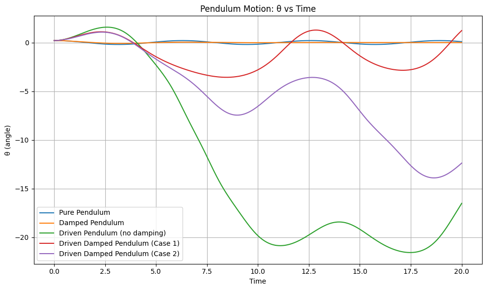
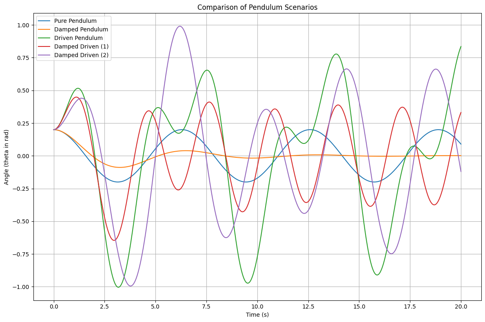
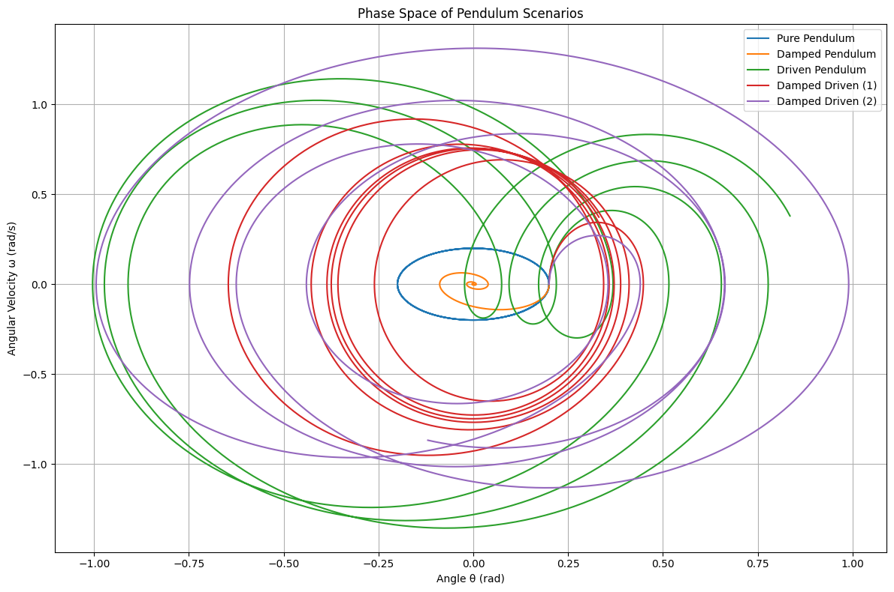
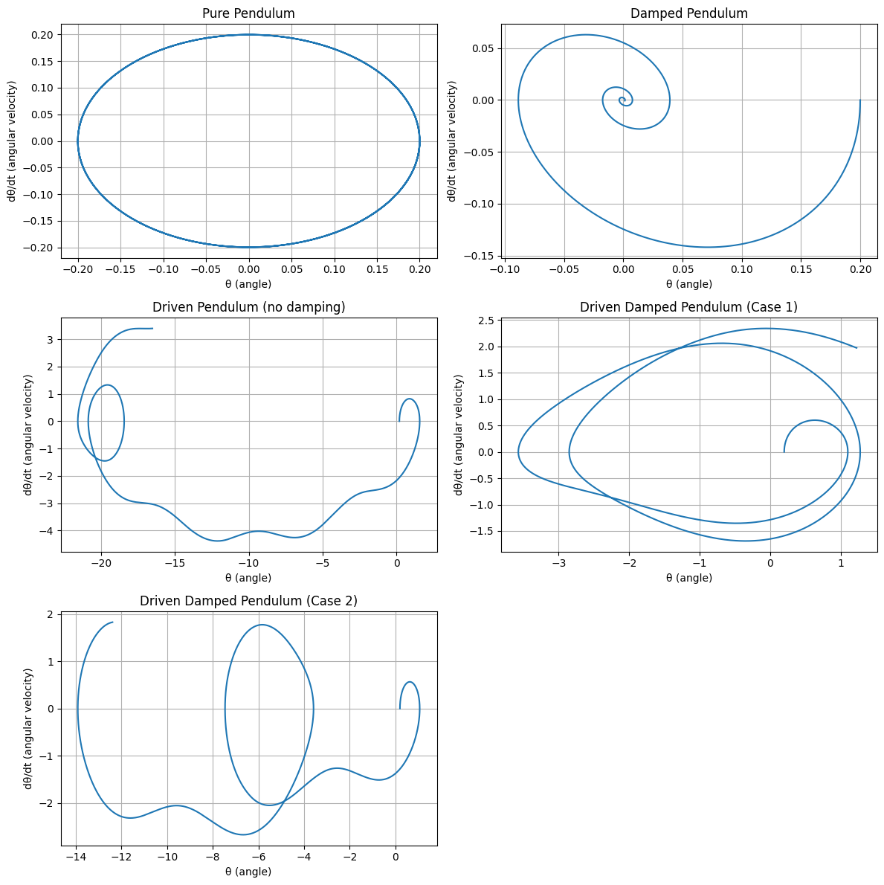
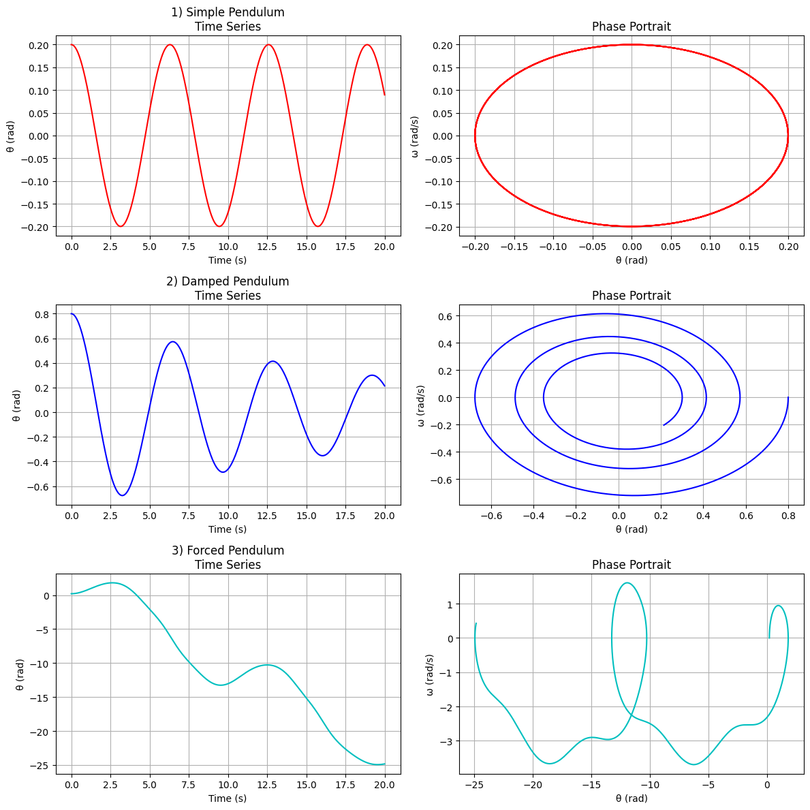

# Problem 2
# Investigating the Dynamics of a Forced Damped Pendulum

## 1. Theoretical Foundation

### 1.1 Governing Equation

The equation of motion for a forced damped pendulum is:

$$
\frac{d^2\theta}{dt^2} + b\frac{d\theta}{dt} + \frac{g}{L}\sin\theta = A\cos(\omega t)
$$

Where:

- $\theta(t)$ is the angular displacement  
- $b$ is the damping coefficient  
- $g$ is gravitational acceleration  
- $L$ is the length of the pendulum  
- $A$ is the amplitude of the driving force  
- $\omega$ is the driving frequency  

---

### 1.2 Small-Angle Approximation

For small angles ($\theta \ll 1$), we approximate $\sin\theta \approx \theta$, reducing the equation to:

$$
\frac{d^2\theta}{dt^2} + b\frac{d\theta}{dt} + \frac{g}{L}\theta = A\cos(\omega t)
$$

This is a linear second-order differential equation describing a damped, driven harmonic oscillator.

---

### 1.3 Resonance

Resonance occurs when the driving frequency $\omega$ matches the natural frequency $\omega_0 = \sqrt{\frac{g}{L}}$. At resonance, the system absorbs energy most efficiently, leading to large oscillations (limited only by damping).

The steady-state amplitude response $\Theta(\omega)$ for the linearized case is:

$$
\Theta(\omega) = \frac{A}{\sqrt{(\omega_0^2 - \omega^2)^2 + (b\omega)^2}}
$$

This curve demonstrates resonance behavior and is important for identifying the critical driving frequency.

---

## 2. Analysis of Dynamics

### 2.1 Parameter Dependence

- **Damping coefficient ($b$):**
  - Controls energy dissipation
  - Low $b$: resonance peak is sharp
  - High $b$: oscillations decay quickly, response is flatter

- **Driving amplitude ($A$):**
  - Larger $A$: stronger external influence
  - Can drive the system into nonlinear or chaotic regimes

- **Driving frequency ($\omega$):**
  - If near $\omega_0$: resonance
  - Away from $\omega_0$: weak or slow oscillations

---

### 2.2 Transition to Chaos

When the small-angle approximation is no longer valid, the equation becomes nonlinear. For certain values of $A$, $\omega$, and $b$, the system exhibits:

- Period doubling  
- Quasiperiodicity  
- Chaotic motion (sensitive dependence on initial conditions)  

To analyze this, phase portraits and Poincaré sections (sampling phase space at intervals of the driving period) are useful.

---

## 3. Practical Applications

The forced damped pendulum is a model for many systems:

- **Energy harvesting:** Mechanical systems coupled to electromagnetic or piezoelectric generators  
- **Suspension bridges:** Dynamic loads (e.g., wind) may cause resonance  
- **Clock mechanisms:** Pendulum dynamics must be stabilized for accurate timekeeping  
- **Oscillating circuits:** Driven RLC circuits act as electrical analogs  
- **Biomechanics:** Human gait and balance involve pendulum-like dynamics under control

---

## 4. Implementation

### 4.1 Python Simulation

```python
import numpy as np
import matplotlib.pyplot as plt
from scipy.integrate import solve_ivp

# Pendulum differential equation
def pendulum(t, y, b, A, omega):
    theta, omega_theta = y
    dydt = [omega_theta, -b * omega_theta - np.sin(theta) + A * np.cos(omega * t)]
    return dydt

# Time span and evaluation points
t_span = (0, 20)
t_eval = np.linspace(*t_span, 1000)

# Initial conditions: small angle, zero initial velocity
y0 = [0.2, 0]

# Define different scenarios
scenarios = {
    "Pure Pendulum": {"b": 0.0, "A": 0.0, "omega": 0.0},
    "Damped Pendulum": {"b": 0.5, "A": 0.0, "omega": 0.0},
    "Driven Pendulum": {"b": 0.0, "A": 1.2, "omega": 2.0},
    "Damped Driven (1)": {"b": 0.5, "A": 1.2, "omega": 2.0},
    "Damped Driven (2)": {"b": 0.2, "A": 0.8, "omega": 1.5}
}

# Solve the ODEs
results = {}
for name, params in scenarios.items():
    sol = solve_ivp(pendulum, t_span, y0, args=(params["b"], params["A"], params["omega"]), t_eval=t_eval)
    results[name] = sol

# Plot phase space
plt.figure(figsize=(12, 8))
for name, sol in results.items():
    plt.plot(sol.y[0], sol.y[1], label=name)

plt.title("Phase Space of Pendulum Scenarios")
plt.xlabel("Angle θ (rad)")
plt.ylabel("Angular Velocity ω (rad/s)")
plt.legend()
plt.grid(True)
plt.tight_layout()
plt.show()
```







### 4.2 Phase Space and Poincaré Section

To investigate chaotic dynamics in the forced damped pendulum, we visualize the motion using:

- **Phase Space:** Plot of $\theta$ vs $\frac{d\theta}{dt}$
- **Poincaré Section:** Discrete samples of the system at each driving period

Let the driving period be:

$$
T = \frac{2\pi}{\omega}
$$

We sample the pendulum state $(\theta, \dot{\theta})$ at times $t = nT$.

```python
# Pendulum

import numpy as np
import matplotlib.pyplot as plt
from scipy.integrate import solve_ivp

# Time span and time points
t_span = (0, 20)
t_eval = np.linspace(*t_span, 1000)

# 1. Simple Pendulum
def simple_pendulum(t, y):
    theta, omega = y
    dydt = [omega, -np.sin(theta)]
    return dydt

sol1 = solve_ivp(simple_pendulum, t_span, [0.2, 0], t_eval=t_eval)

# 2. Damped Pendulum
def damped_pendulum(t, y, gamma=0.1):
    theta, omega = y
    dydt = [omega, -gamma * omega - np.sin(theta)]
    return dydt

sol2 = solve_ivp(damped_pendulum, t_span, [0.8, 0], t_eval=t_eval)

# 3. Forced Pendulum
def forced_pendulum(t, y, gamma=0.2, A=1.5, omega_drive=2/3):
    theta, omega = y
    dydt = [omega, -gamma * omega - np.sin(theta) + A * np.cos(omega_drive * t)]
    return dydt

sol3 = solve_ivp(forced_pendulum, t_span, [0.2, 0], t_eval=t_eval)

# Plotting
fig, axs = plt.subplots(3, 2, figsize=(12, 12))

# Simple
axs[0, 0].plot(sol1.t, sol1.y[0], 'r')
axs[0, 0].set_title("1) Simple Pendulum\nTime Series")
axs[0, 1].plot(sol1.y[0], sol1.y[1], 'r')
axs[0, 1].set_title("Phase Portrait")

# Damped
axs[1, 0].plot(sol2.t, sol2.y[0], 'b')
axs[1, 0].set_title("2) Damped Pendulum\nTime Series")
axs[1, 1].plot(sol2.y[0], sol2.y[1], 'b')
axs[1, 1].set_title("Phase Portrait")

# Forced
axs[2, 0].plot(sol3.t, sol3.y[0], 'c')
axs[2, 0].set_title("3) Forced Pendulum\nTime Series")
axs[2, 1].plot(sol3.y[0], sol3.y[1], 'c')
axs[2, 1].set_title("Phase Portrait")

for ax in axs.flat:
    ax.set_xlabel('Time (s)' if 'Time Series' in ax.get_title() else 'θ (rad)')
    ax.set_ylabel('θ (rad)' if 'Time Series' in ax.get_title() else 'ω (rad/s)')
    ax.grid(True)

plt.tight_layout()
plt.show()
```





## My Colab (Canliy961)

[Forced Damped Pendulum Motion](https://colab.research.google.com/drive/1ChCV0WpqC_N0MRDeVVmX-RlVBk-q18iC?usp=sharing)

[Phase Space of Pendulum Scenarios](https://colab.research.google.com/drive/1_u0mcVN_HA9ENFffx2uQEh5z8ottTHjK)

[Phase Space](https://colab.research.google.com/drive/1iAJC5e2gNESfR7MB-qOPk4mYQdAPPUDj?usp=sharing)

[Comparison of Pendulum Scenarios](https://colab.research.google.com/drive/1asmixWNaoVuzKnS9TqtYmh1wxVLSz72f)

[Pendulum](https://colab.research.google.com/drive/1u9819xkIKfu5L6UX-P2VBGwM9de2E4zr#scrollTo=sAfOZ1RUiXth)
