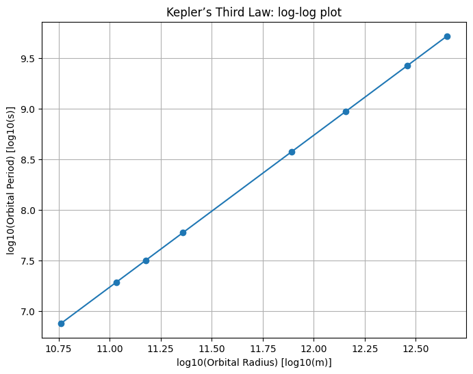
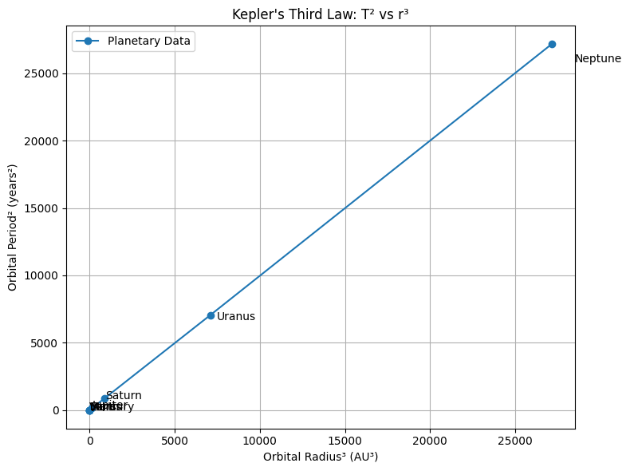
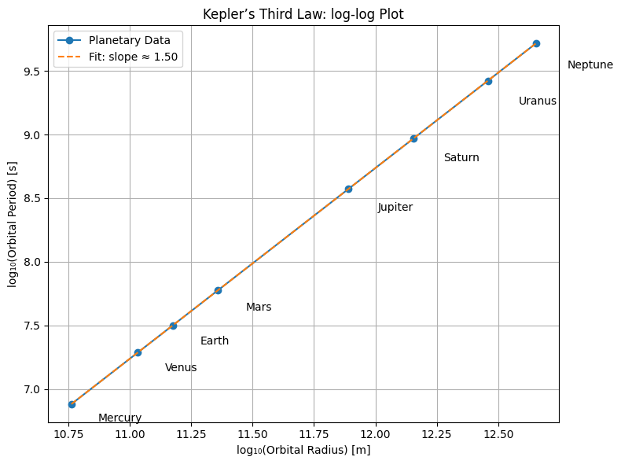

# Problem 1
# Kepler’s Third Law: Orbital Period and Orbital Radius

## 1. Theoretical Derivation

**Kepler’s Third Law (Simplified for Circular Orbits)**

For a body in a circular orbit around a much more massive body, the gravitational force provides the necessary centripetal force:

- Gravitational Force:  
  $F_{\text{gravity}} = \frac{G M m}{r^2}$

- Centripetal Force:  
  $F_{\text{centripetal}} = \frac{m v^2}{r}$

Equating both forces:

$$
\frac{G M m}{r^2} = \frac{m v^2}{r} \Rightarrow v^2 = \frac{G M}{r}
$$

Orbital period $T$ is related to velocity $v$ and radius $r$:

$$
v = \frac{2\pi r}{T} \Rightarrow \left( \frac{2\pi r}{T} \right)^2 = \frac{G M}{r}
$$

$$
\Rightarrow \frac{4\pi^2 r^2}{T^2} = \frac{G M}{r} \Rightarrow T^2 = \frac{4\pi^2 r^3}{G M}
$$

**Kepler’s Third Law:**  
$T^2 \propto r^3$

---

## 2. Astronomical Implications

- **Planetary Mass Determination:**  
  If you know a moon's orbit ($T$, $r$), you can calculate the mass of the planet using:  
  $$
  M = \frac{4\pi^2 r^3}{G T^2}
  $$

- **Interplanetary Distance:**  
  Comparing periods and distances of planets allows relative distances from the Sun to be calculated without direct measurements.

- **Satellite Orbit Design:**  
  Used to determine the correct altitude for geosynchronous orbits.

### Newton’s Form of Kepler’s Third Law

Newton's version of Kepler’s Third Law is:

$$
T^2 = \frac{4\pi^2 r^3}{G M}
$$

Where:
- $T$ is the orbital period (in seconds)  
- $r$ is the orbital radius (in meters)  
- $G$ is the gravitational constant, approximately $6.674 \times 10^{-11} \ \text{m}^3 \ \text{kg}^{-1} \ \text{s}^{-2}$  
- $M$ is the mass of the central object (Earth or Sun)

---

### 2.1 Mass of the Earth (using the Moon's orbit)

Given:
- $T = 27.3$ days $= 2.36 \times 10^6$ s  
- $r = 3.84 \times 10^8$ m

From the formula:

$$
M = \frac{4\pi^2 r^3}{G T^2}
$$

Substitute the values:

$$
M = \frac{4\pi^2 (3.84 \times 10^8)^3}{6.674 \times 10^{-11} (2.36 \times 10^6)^2}
$$

Result:

$$
M \approx 5.97 \times 10^{24} \ \text{kg}
$$

 This is the **mass of the Earth**.

---

###  2.2 Mass of the Sun (using Earth's orbit)

Given:
- $T = 1$ year $= 3.156 \times 10^7$ s  
- $r = 1.496 \times 10^{11}$ m

Apply the same formula:

$$
M = \frac{4\pi^2 r^3}{G T^2}
$$

Substitute the values:

$$
M = \frac{4\pi^2 (1.496 \times 10^{11})^3}{6.674 \times 10^{-11} (3.156 \times 10^7)^2}
$$

Result:

$$
M \approx 1.99 \times 10^{30} \ \text{kg}
$$

 This is the **mass of the Sun**.

---

## 3. Real-World Examples

### Example 1: The Moon Orbiting Earth

- Radius: $r \approx 3.84 \times 10^8 \ \text{m}$  
- Period: $T \approx 27.3 \ \text{days} \approx 2.36 \times 10^6 \ \text{s}$

Using Kepler’s law, we can estimate Earth’s mass.

### Example 2: Solar System Planets

By plotting $\log(T)$ vs. $\log(r)$ for planets, we should get a straight line with slope $\approx 1.5$.

---

## 4. Computational Simulation

```python
import numpy as np
import matplotlib.pyplot as plt

# Constants
G = 6.67430e-11  # Gravitational constant
M = 1.989e30     # Mass of the Sun (kg)

# Orbital radii (m) - approximate average values
radii = np.array([
    5.79e10,  # Mercury
    1.08e11,  # Venus
    1.50e11,  # Earth
    2.28e11,  # Mars
    7.78e11,  # Jupiter
    1.43e12,  # Saturn
    2.87e12,  # Uranus
    4.50e12   # Neptune
])

# Compute periods using Kepler's Third Law
T = np.sqrt((4 * np.pi**2 * radii**3) / (G * M))

# Plot log(T) vs log(r)
plt.figure(figsize=(8,6))
plt.plot(np.log10(radii), np.log10(T), 'o-')
plt.xlabel("log10(Orbital Radius) [log10(m)]")
plt.ylabel("log10(Orbital Period) [log10(s)]")
plt.title("Kepler’s Third Law: log-log plot")
plt.grid(True)
plt.show()
```



---

## 5. Graphical Representation

A circular orbit simulation can be animated using `matplotlib.animation`.

Orbital period data from real planets supports the  
$T^2 \propto r^3$ relationship.

---

## 6. Extension to Elliptical Orbits

Kepler’s Third Law still applies if $r$ is replaced with the semi-major axis $a$.

For elliptical orbits:

$$
T^2 = \frac{4\pi^2 a^3}{G M}
$$

This allows for broader applications, including comets, exoplanets, and binary stars.





## My Colab (Canliy961)

[Kepler's Third Law](https://colab.research.google.com/drive/1J-SFd_Bao0arPcFZ-G2kJ-pq2pM0nDz4#scrollTo=qAX9SwFgJLUR)
