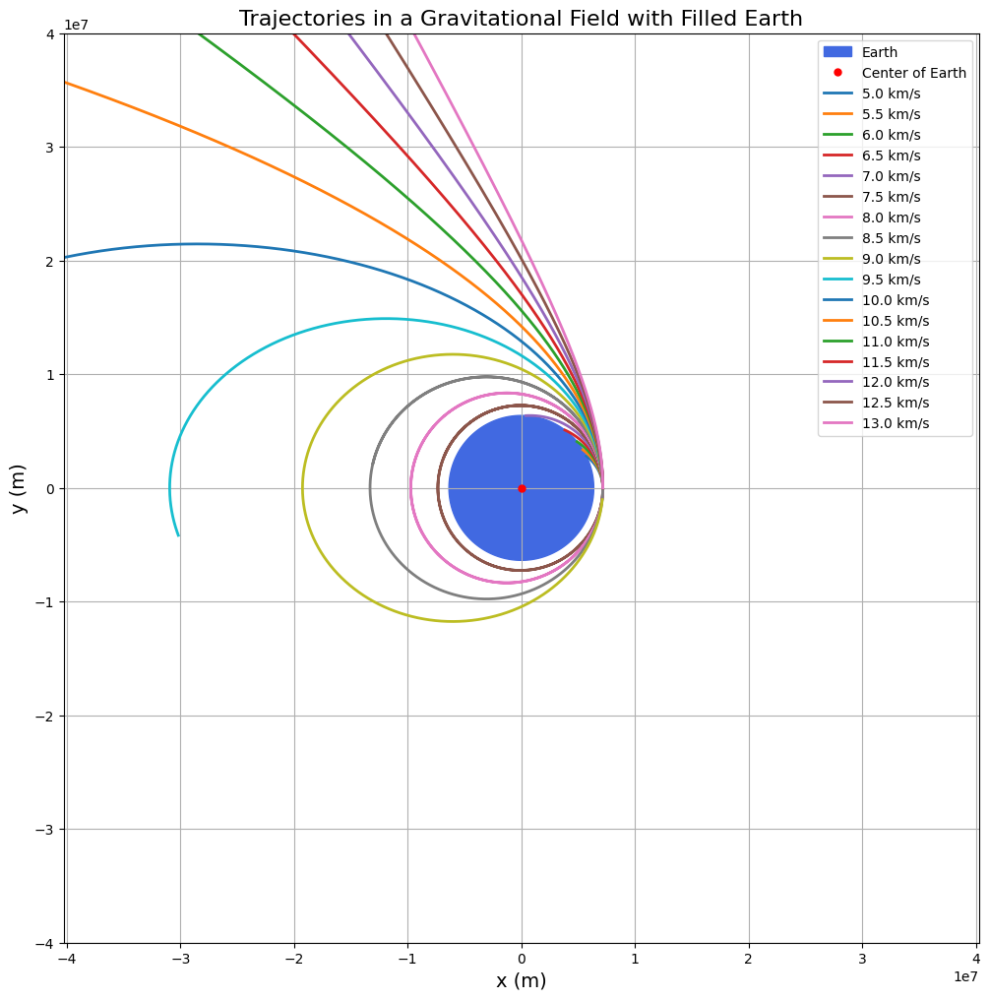
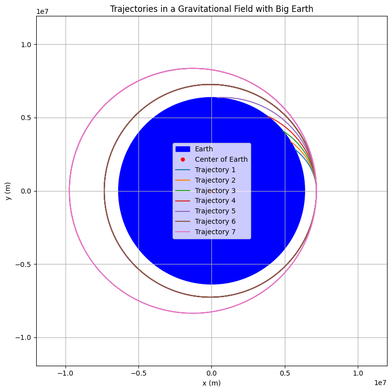

# Problem 3
# Trajectories of a Freely Released Payload Near Earth

## 1. Theoretical Background

When a payload is released from a moving spacecraft near Earth, its trajectory depends on:

- Initial position (altitude above Earth's surface),
- Initial velocity (magnitude and direction),
- Gravitational force acting toward Earth’s center.

The motion is governed by Newton’s Law of Universal Gravitation:

$$
F = \frac{G M m}{r^2}
$$

Where:

- $F$ is the gravitational force,
- $G = 6.67430 \times 10^{-11} \, \text{m}^3 \, \text{kg}^{-1} \, \text{s}^{-2}$ is the gravitational constant,
- $M$ is Earth's mass ($5.972 \times 10^{24} \, \text{kg}$),
- $m$ is the mass of the payload (cancels out),
- $r$ is the distance from Earth's center.

The equation of motion becomes:

$$
\ddot{r} = -\frac{G M}{r^3} r
$$

Depending on the energy:

- Elliptical trajectory if total energy $E < 0$,
- Parabolic trajectory if $E = 0$,
- Hyperbolic trajectory if $E > 0$.

Where total energy:

$$
E = \frac{1}{2} m v^2 - \frac{G M m}{r}
$$

Escape velocity at a given altitude:

$$
v_{\text{esc}} = \sqrt{\frac{2 G M}{r}}
$$

If $v < v_{\text{esc}}$: payload remains bound (orbit or reentry).

If $v \geq v_{\text{esc}}$: payload escapes Earth’s gravity.

---

## 2. Numerical Simulation Approach

We solve the second-order differential equation for motion numerically using time stepping (Euler or Runge-Kutta 4th order).

At each time step:

- Update acceleration based on current position.
- Update velocity based on acceleration.
- Update position based on velocity.

We assume:

- No atmospheric drag (valid at high altitudes).

---

## 3. Python Script

```python
import numpy as np
import matplotlib.pyplot as plt

# Constants
G = 6.67430e-11  # gravitational constant, m^3/kg/s^2
M_earth = 5.972e24  # mass of Earth, kg
R_earth = 6371e3  # radius of Earth, meters

# Function to compute acceleration
def acceleration(r):
    r_norm = np.linalg.norm(r)
    return -G * M_earth * r / r_norm**3

# Runge-Kutta 4th order method
def rk4_step(r, v, dt):
    k1_v = acceleration(r)
    k1_r = v

    k2_v = acceleration(r + 0.5*dt*k1_r)
    k2_r = v + 0.5*dt*k1_v

    k3_v = acceleration(r + 0.5*dt*k2_r)
    k3_r = v + 0.5*dt*k2_v

    k4_v = acceleration(r + dt*k3_r)
    k4_r = v + dt*k3_v

    r_new = r + (dt/6)*(k1_r + 2*k2_r + 2*k3_r + k4_r)
    v_new = v + (dt/6)*(k1_v + 2*k2_v + 2*k3_v + k4_v)

    return r_new, v_new

# Simulation function
def simulate_trajectory(r0, v0, t_max, dt):
    r = r0.copy()
    v = v0.copy()
    positions = [r0]

    for _ in range(int(t_max/dt)):
        r, v = rk4_step(r, v, dt)
        positions.append(r)

        if np.linalg.norm(r) < R_earth:  # collision with Earth
            break

    return np.array(positions)

# Initial conditions
altitude = 800e3  # 800 km above Earth's surface
r0 = np.array([R_earth + altitude, 0])  # starting position on the right
v_magnitudes = np.arange(5e3, 13.5e3, 0.5e3)  # from 5 km/s to 13 km/s

# Plot setup
fig, ax = plt.subplots(figsize=(12,12))

# Draw Earth (darker blue)
theta = np.linspace(0, 2*np.pi, 500)
earth_x = R_earth * np.cos(theta)
earth_y = R_earth * np.sin(theta)
ax.fill(earth_x, earth_y, color='royalblue', label="Earth")

# Mark center of Earth
ax.plot(0, 0, 'r.', markersize=10, label="Center of Earth")

# Simulate and plot for each velocity
for idx, v0_mag in enumerate(v_magnitudes):
    v0 = np.array([0, v0_mag])  # vertically shooting
    trajectory = simulate_trajectory(r0, v0, t_max=15000, dt=1)
    ax.plot(trajectory[:,0], trajectory[:,1], lw=2, label=f'{v0_mag/1e3:.1f} km/s')

# Final plot settings
ax.set_xlabel('x (m)', fontsize=14)
ax.set_ylabel('y (m)', fontsize=14)
ax.set_title('Trajectories in a Gravitational Field with Filled Earth', fontsize=16)
ax.legend(fontsize=10)
ax.grid(True)
ax.axis('equal')
ax.set_xlim(-4e7, 4e7)
ax.set_ylim(-4e7, 4e7)

plt.show()
```





## My Colab (Canliy961)

[Trajectories in Gravitational Field](https://colab.research.google.com/drive/1-evxyB7Hd3zIBsgVpNY7_62dbJIUNXuB#scrollTo=ExcQlDW_Sz97)