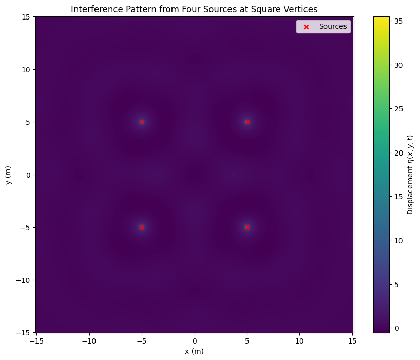

# Problem 1
# Interference Patterns on a Water Surface

## 1. Introduction
We study the interference of waves generated from multiple point sources arranged at the vertices of a regular polygon. Each source emits circular waves, and the principle of superposition is used to find the overall displacement on the surface.

## 2. Polygon Selection
We choose a square (regular quadrilateral) for simplicity.

Thus, 4 sources are placed at the vertices of a square.

## 3. Mathematical Model
A single wave from a source at $(x_0, y_0)$ is:

$$
\eta(x,y,t) = \frac{A}{r} \cos(kr - \omega t + \phi)
$$

where:

$$
r = \sqrt{(x-x_0)^2 + (y-y_0)^2}
$$

$$
k = \frac{2\pi}{\lambda} \quad \text{(wave number)}
$$

$$
\omega = 2\pi f \quad \text{(angular frequency)}
$$

$A$ is the amplitude, and $\phi$ is the initial phase (we can set $\phi = 0$ for simplicity).

The total displacement is:

$$
\eta_{\text{sum}}(x,y,t) = \sum_{i=1}^{4} \eta_i(x,y,t)
$$

## 4. Simulation Setup
All sources have the same $A$, $\lambda$, and $f$.

The square is centered at the origin, with vertices at:

- $(d, d)$
- $(-d, d)$
- $(-d, -d)$
- $(d, -d)$

We will simulate the water surface over a grid in $(x,y)$ space.

## 5. Python Code

```python
# Import necessary libraries
import numpy as np
import matplotlib.pyplot as plt

# Wave parameters
A = 1.0          # Amplitude
wavelength = 5.0 # Wavelength (lambda)
frequency = 1.0  # Frequency (Hz)
k = 2 * np.pi / wavelength # Wave number
omega = 2 * np.pi * frequency # Angular frequency
phi = 0          # Phase
d = 5.0          # Half-length of square side (distance from center to vertex)

# Time at which to evaluate
t = 0.0

# Grid setup
x = np.linspace(-15, 15, 500)
y = np.linspace(-15, 15, 500)
X, Y = np.meshgrid(x, y)

# Source positions (square vertices)
sources = [
    (d, d),
    (-d, d),
    (-d, -d),
    (d, -d)
]

# Calculate total displacement
eta_sum = np.zeros_like(X)

for (x0, y0) in sources:
    r = np.sqrt((X - x0)**2 + (Y - y0)**2) + 1e-6  # Add small term to avoid division by zero
    eta = (A / r) * np.cos(k * r - omega * t + phi)
    eta_sum += eta

# Plotting
plt.figure(figsize=(10, 8))
plt.pcolormesh(X, Y, eta_sum, shading='auto', cmap='viridis')
plt.colorbar(label='Displacement $\eta(x,y,t)$')
plt.title('Interference Pattern from Four Sources at Square Vertices')
plt.xlabel('x (m)')
plt.ylabel('y (m)')
plt.scatter(*zip(*sources), color='red', marker='x', label='Sources')
plt.legend()
plt.axis('equal')
plt.show()
```



## 6. Analysis of Interference Patterns

**Constructive Interference:**

Occurs where the waves from all sources arrive in phase (crest meets crest). These appear as bright regions on the plot.

**Destructive Interference:**

Occurs where waves are out of phase (crest meets trough), leading to cancellation. These appear as dark regions.

**Pattern Symmetry:**

Since the sources are symmetrically placed (square), the interference pattern is symmetric about the $x$ and $y$ axes.

**Radial Effects:**

Close to each source, circular patterns dominate. Farther away, the patterns become more complex due to interaction of multiple wavefronts.

## 7. Possible Extensions

- Animate the pattern over time to visualize how the interference evolves dynamically.
- Try other polygons (triangle, pentagon, hexagon) and compare the resulting patterns.
- Introduce slight phase differences between the sources and study how the interference pattern changes.

