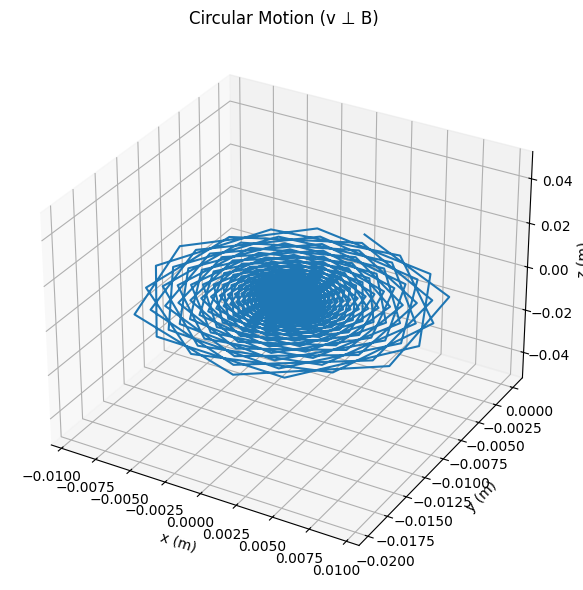
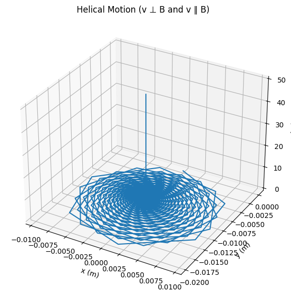
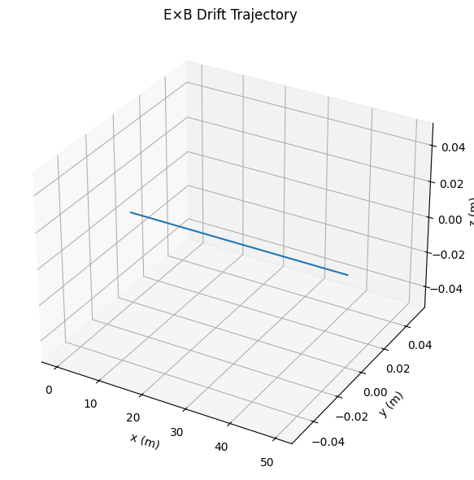

# Problem 1

# Simulating the Effects of the Lorentz Force

## 1. Exploration of Applications  
The Lorentz force governs the dynamics of charged particles in electric and magnetic fields:  
$F = q(\mathbf{E} + \mathbf{v} \times \mathbf{B})$

**Key Applications:**
- **Particle accelerators** (e.g., cyclotrons, synchrotrons): guide particles in circular paths using magnetic fields.  
- **Mass spectrometers**: use electric and magnetic fields to separate particles by mass-to-charge ratio.  
- **Plasma confinement**: magnetic fields trap and control plasma in fusion devices like tokamaks.  
- **Astrophysics**: cosmic rays spiral along interstellar magnetic field lines.

## 2. Simulating Particle Motion  
**Governing Equation:**  
We simulate particle motion using Newton’s 2nd law:  
$m \frac{d\mathbf{v}}{dt} = q(\mathbf{E} + \mathbf{v} \times \mathbf{B})$

Use Runge-Kutta (RK4) to solve this system numerically.

## 3. Python Code: Lorentz Force Simulation
```python
import numpy as np
import matplotlib.pyplot as plt
from mpl_toolkits.mplot3d import Axes3D

# Parameters: macroscopic charge and mass
q = 1.0        # Charge in Coulombs
m = 0.001      # Mass in kilograms (1 gram)

# Field configuration
E = np.array([0, 0, 0])    # Electric field (V/m)
B = np.array([0, 0, 1])    # Magnetic field (T)

# Initial conditions for helical motion
v0 = np.array([10, 0, 10])  # Initial velocity (m/s)
r0 = np.array([0, 0, 0])    # Initial position (m)

# Time settings
dt = 0.001  # Time step (s)
T = 5       # Total simulation time (s)
N = int(T / dt)

# Arrays to store positions and velocities
positions = np.zeros((N, 3))
velocities = np.zeros((N, 3))
positions[0] = r0
velocities[0] = v0

# Lorentz acceleration
def lorentz_accel(v, B, E):
    return (q / m) * (E + np.cross(v, B))

# Runge-Kutta 4th Order Integration
for i in range(N - 1):
    r = positions[i]
    v = velocities[i]

    k1v = lorentz_accel(v, B, E)
    k1r = v

    k2v = lorentz_accel(v + 0.5 * dt * k1v, B, E)
    k2r = v + 0.5 * dt * k1v

    k3v = lorentz_accel(v + 0.5 * dt * k2v, B, E)
    k3r = v + 0.5 * dt * k2v

    k4v = lorentz_accel(v + dt * k3v, B, E)
    k4r = v + dt * k3v

    velocities[i+1] = v + (dt / 6) * (k1v + 2*k2v + 2*k3v + k4v)
    positions[i+1] = r + (dt / 6) * (k1r + 2*k2r + 2*k3r + k4r)

# Plot the 3D trajectory
fig = plt.figure(figsize=(10, 6))
ax = fig.add_subplot(111, projection='3d')
ax.plot(positions[:, 0], positions[:, 1], positions[:, 2])
ax.set_xlabel('x (m)')
ax.set_ylabel('y (m)')
ax.set_zlabel('z (m)')
ax.set_title('Helical Trajectory (q = 1 C, m = 1g)')
plt.tight_layout()
plt.show()
```


## 4. Parameter Exploration

**Field strengths ($\vec{E}$, $\vec{B}$):**  
Increasing magnetic field strength increases curvature (reduces Larmor radius).

**Initial velocity ($\vec{v}_0$):**  
Faster particles form larger spirals.

**Charge-to-mass ratio ($\frac{q}{m}$):**  
Heavier particles spiral less tightly.

### Characteristic Quantities

**Larmor Radius:**

$$
r_L = \frac{m v_\perp}{|q| B}
$$

**Cyclotron Frequency:**

$$
\omega_c = \frac{|q| B}{m}
$$

These quantities determine circular and spiral motion of particles in magnetic fields.

---

## 5. Physical Interpretation

### Case 1: Uniform Magnetic Field  
- Particle undergoes **circular or helical** motion.  
- If velocity has a component along the field direction, motion is **helical**.

### Case 2: Crossed Electric and Magnetic Fields  
- Particle experiences **$\vec{E} \times \vec{B}$ drift**:

$$
\vec{v}_{\text{drift}} = \frac{\vec{E} \times \vec{B}}{B^2}
$$







**Explanation:**  
The $\vec{E} \times \vec{B}$ drift velocity is given by:

$$
\vec{v}_{\text{drift}} = \frac{\vec{E} \times \vec{B}}{B^2}
$$

For $\vec{E} = [0, 10, 0]$ and $\vec{B} = [0, 0, 1]$, we get:

$$
\vec{v}_{\text{drift}} = \frac{[0, 10, 0] \times [0, 0, 1]}{1^2} = \frac{[10, 0, 0]}{1} = [10, 0, 0]
$$

The result is a circular or spiral motion in the plane, drifting steadily in the $x$-direction — a common effect in plasma physics and beam devices.


## My Colab (Canliy961)

[Lorentz Force](https://colab.research.google.com/drive/1DjZTBUMW_Lkngzsa6vyPxuFU_I6KVTIs#scrollTo=AWnZQk2UcWon)
