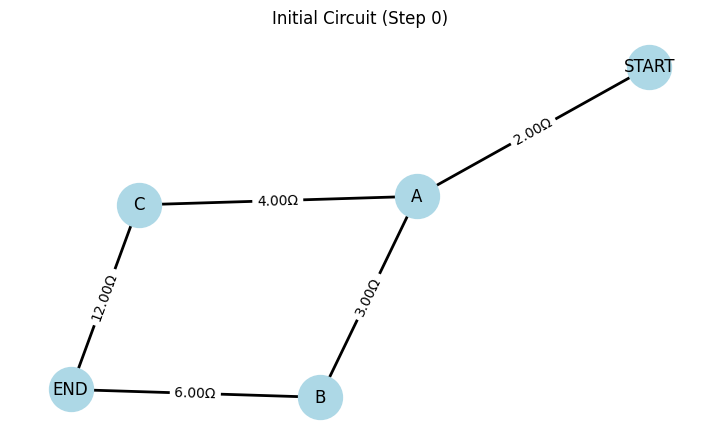
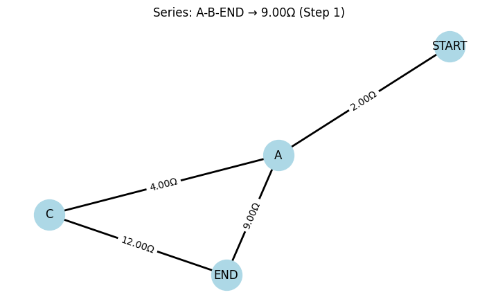
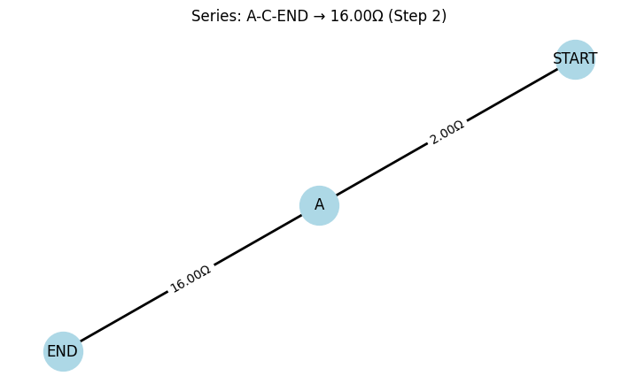
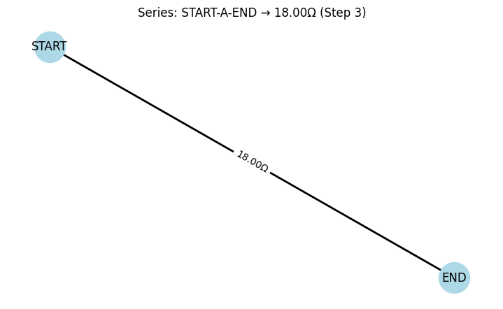

# Problem 1
# Equivalent Resistance Using Graph Theory

## Introduction and Motivation

Calculating equivalent resistance is a fundamental task in electrical circuit analysis. Traditionally, this is done by simplifying series and parallel connections step by step. However, as circuits grow in complexity—with many nested or cyclic components—these methods become less efficient and prone to error.

By applying graph theory, we gain a structured and scalable approach to simplifying resistor networks. Each resistor is modeled as a weighted edge in a graph, and nodes represent circuit junctions. The total resistance between two terminals is then reduced algorithmically, leveraging insights from graph traversal and reduction.

This method is not only more efficient for computational tools but also provides a deeper understanding of the interconnectivity and structure within circuits.

## Learning Objectives

After completing this task, you should be able to:

- Represent a resistor network as a graph.
- Identify and reduce series and parallel resistor combinations using graph-based methods.
- Understand and implement a simplification algorithm that handles arbitrary circuit complexity.
- Apply the algorithm to both simple and complex circuit topologies.

## Theory Refresher

### Series Connection

If two resistors $R_1$ and $R_2$ are in series:

$$
R_{eq} = R_1 + R_2
$$

### Parallel Connection

If two resistors $R_1$ and $R_2$ are in parallel:

$$
\frac{1}{R_{eq}} = \frac{1}{R_1} + \frac{1}{R_2}
$$

or

$$
R_{eq} = \left( \frac{1}{R_1} + \frac{1}{R_2} \right)^{-1}
$$

Graph theory allows us to detect these configurations algorithmically and apply such reductions iteratively.

### Step 0 – Initial Circuit

Two paths from **A** to **END**:

- **Path 1**: $A \rightarrow B \rightarrow \text{END} = 3\,\Omega + 6\,\Omega = 9\,\Omega$
- **Path 2**: $A \rightarrow C \rightarrow \text{END} = 4\,\Omega + 12\,\Omega = 16\,\Omega$

---

### Step 1 – Combine Series Resistors

Resistors on $A \rightarrow B$ and $B \rightarrow \text{END}$ are in series:

$$
R_{A\rightarrow B\rightarrow \text{END}} = 3 + 6 = 9\,\Omega
$$

---

### Step 2 – Combine Parallel Resistors

Now combine the two parallel paths from **A to END**:

- One path: $9\,\Omega$
- Other path: $16\,\Omega$

Use the parallel formula:

$$
\frac{1}{R_{eq}} = \frac{1}{9} + \frac{1}{16} = \frac{25}{144}
\quad \Rightarrow \quad
R_{eq} = \frac{144}{25} \approx 5.76\,\Omega
$$

---

### Step 3 – Final Series Combination

The path from **START → A** has:

$$
R_{\text{START} \rightarrow A} = 2\,\Omega
$$

And from **A → END** we just calculated:

$$
R_{A \rightarrow \text{END}} = 5.76\,\Omega
$$

**Final total resistance**:

$$
R_{\text{total}} = 2 + 5.76 = 7.76\,\Omega
$$

## Task Description

### Choose One:

**Option 1: Simplified Task – Algorithm Description**

Describe a general-purpose algorithm that calculates equivalent resistance using graph-theoretical principles.

Include pseudocode for:

- Detecting series and parallel components.
- Iteratively simplifying the network.

Explain how your algorithm manages nested combinations (e.g., a parallel branch containing a series connection).

---

**Option 2: Advanced Task – Full Implementation**

Develop a full implementation in a language such as Python (recommended with `networkx`).

Your implementation must:

- Accept a circuit graph as input.
- Handle:
  - Series and parallel connections.
  - Nested and cyclic structures.
- Output the equivalent resistance between any two terminals.

## Expected Deliverables

- Pseudocode and/or working code.
- Step-by-step walkthrough of 3 sample circuits:
  - Pure series
  - Pure parallel
  - Complex nested configuration
- Discussion of:
  - Algorithm correctness
  - Efficiency
  - Potential enhancements (e.g., use of disjoint-set structures or symbolic resistance handling)

## Helpful Hints

- Use graphs: Nodes = junctions, edges = resistors (with resistance as weight).
- Use traversal: Use DFS or BFS to detect series chains or parallel branches.
- Iterate reduction: Collapse detected subgraphs until one equivalent edge remains.
- Check for cycles: Useful for identifying parallel paths.
- Libraries like `networkx` can significantly speed up development.

## My Colab (Canliy961)

[Equivalent Resistance](https://colab.research.google.com/drive/1WQOjRSSeJFwXCIz9FGuK2AYQrQzfH3Tc#scrollTo=aX2vbhOwus2n)
