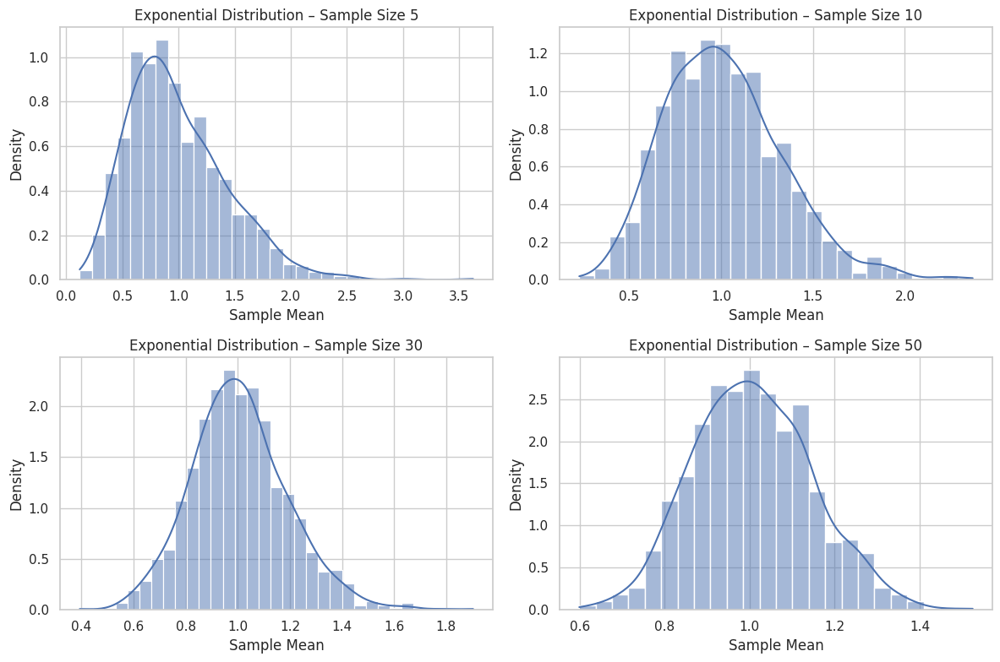
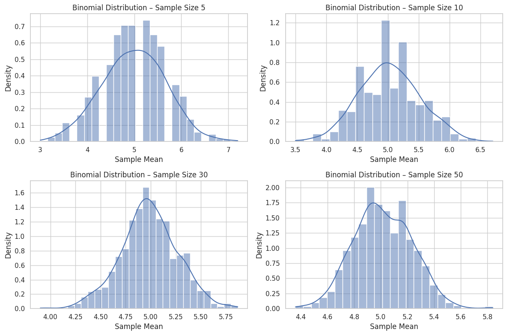
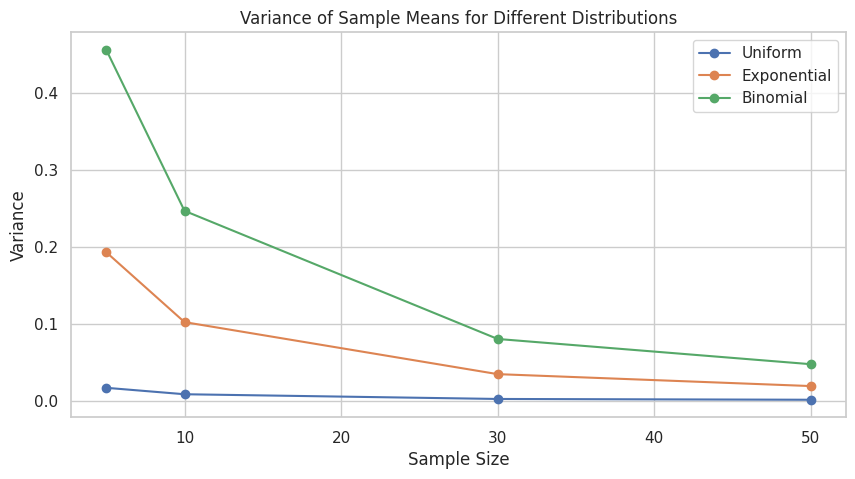

# Problem 1
# Central Limit Theorem (CLT) – Simulation and Analysis

## 1. Population Distributions Used

We will use three types of distributions to represent different population shapes:

- **Uniform Distribution**: All values are equally likely. (Symmetric)
- **Exponential Distribution**: Highly right-skewed. (Asymmetric)
- **Binomial Distribution**: Discrete distribution counting the number of successes in fixed trials.

Each population will consist of a large number of data points (e.g., 100,000 values) to closely approximate a real-world dataset.

---

## 2. Sampling and Sample Means

From each population, we will:

- Randomly draw many samples of fixed sizes (e.g., 5, 10, 30, 50).
- Compute the sample mean for each sample.

### What Is a Sample Mean?

The sample mean (average) of a sample of size $n$ is given by:
$
\[
\bar{X} = \frac{1}{n} \sum_{i=1}^{n} X_i
\]
$
We will repeat the sampling process many times (e.g., 1,000 times per sample size) to build a sampling distribution of the sample mean.

---

## 3. Visualization of Sampling Distributions

We will plot histograms of sample means for each sample size. As the sample size increases:

- The shape of the sampling distribution becomes more bell-shaped.
- The distribution gets more concentrated around the true population mean.

This visually demonstrates how the CLT works in practice.

---

## 4. Effect of Sample Size on Spread

According to the CLT, the variance of the sample mean decreases as the sample size increases:

\[
\text{Var}(\bar{X}) = \frac{\sigma^2}{n}
\]

This means that:

- Larger samples lead to more consistent and reliable sample means.
- The spread (standard deviation) of the sampling distribution gets smaller as $n$ increases.

We will plot how the variance of the sample means changes with different sample sizes for each distribution.

---

## 5. Reflections and Real-World Applications

Why is the Central Limit Theorem so important?

### Parameter Estimation:
- It justifies using sample means to estimate unknown population means.
- Confidence intervals are based on the assumption of normality of sample means.

### Quality Control:
- In manufacturing, means of product measurements are monitored using control charts, assuming normality.

### Finance and Economics:
- Financial returns of diversified portfolios often behave like normal distributions due to the CLT.

### Hypothesis Testing:
- Most parametric tests rely on the assumption that the sampling distribution of the test statistic is normal.

---

## 6. Python Simulation
```python
import numpy as np
import matplotlib.pyplot as plt
import seaborn as sns

# Set seed for reproducibility
np.random.seed(42)

# ----- Population Generation -----
population_size = 100_000

pop_uniform = np.random.uniform(0, 1, population_size)
pop_exponential = np.random.exponential(scale=1.0, size=population_size)
pop_binomial = np.random.binomial(n=10, p=0.5, size=population_size)

# ----- Plot Population Distribution -----
def plot_population(data, title):
    plt.figure(figsize=(6, 3))
    sns.histplot(data, bins=50, kde=True)
    plt.title(f'{title} Population')
    plt.xlabel('Value')
    plt.ylabel('Frequency')
    plt.grid(True)
    plt.show()

plot_population(pop_uniform, "Uniform")
plot_population(pop_exponential, "Exponential")
plot_population(pop_binomial, "Binomial")

# ----- Simulate Sampling Distribution -----
def simulate_sampling_distribution(population, sample_sizes, num_samples=1000):
    result = {}
    for size in sample_sizes:
        means = [np.mean(np.random.choice(population, size, replace=False)) for _ in range(num_samples)]
        result[size] = means
    return result

# ----- Plot Sampling Distributions -----
def plot_sampling_distributions(sampling_distributions, title):
    for size, means in sampling_distributions.items():
        plt.figure(figsize=(6, 3))
        sns.histplot(means, kde=True, stat="density")
        plt.title(f'{title} – Sample Size {size}')
        plt.xlabel('Sample Mean')
        plt.ylabel('Density')
        plt.grid(True)
        plt.show()

# ----- Plot Variance Shrinkage -----
def plot_variance_change(sampling_distributions, title):
    sizes = list(sampling_distributions.keys())
    variances = [np.var(means) for means in sampling_distributions.values()]
    plt.figure(figsize=(5, 3))
    plt.plot(sizes, variances, marker='o')
    plt.title(f'Variance of Sample Means – {title}')
    plt.xlabel('Sample Size')
    plt.ylabel('Variance')
    plt.grid(True)
    plt.show()

# ----- Run Simulations -----
sample_sizes = [5, 10, 30, 50]

uniform_samples = simulate_sampling_distribution(pop_uniform, sample_sizes)
exp_samples = simulate_sampling_distribution(pop_exponential, sample_sizes)
binom_samples = simulate_sampling_distribution(pop_binomial, sample_sizes)

# ----- Plot Sampling Distributions -----
plot_sampling_distributions(uniform_samples, "Uniform Distribution")
plot_sampling_distributions(exp_samples, "Exponential Distribution")
plot_sampling_distributions(binom_samples, "Binomial Distribution")

# ----- Plot Variance Shrinkage -----
plot_variance_change(uniform_samples, "Uniform")
plot_variance_change(exp_samples, "Exponential")
plot_variance_change(binom_samples, "Binomial")
```








---

## 7. Summary and Conclusion

- The Central Limit Theorem holds regardless of the original population shape — even if it is skewed or discrete.
- Symmetric populations (e.g., uniform, binomial) converge to normality faster.
- Skewed distributions (e.g., exponential) need larger sample sizes for the sample mean distribution to resemble a normal distribution.
- The standard deviation (spread) of the sample mean shrinks with increasing sample size — providing more precise estimates.

This simulation clearly illustrates the power and universality of the CLT in statistics and real-world applications.

## My Colab (Canliy961)

[Central Limit Theorem](https://colab.research.google.com/drive/1nzsN068K2O3LknP49-9yFWLcKTaFEfxa#scrollTo=kuSICUk8ZrGM)
