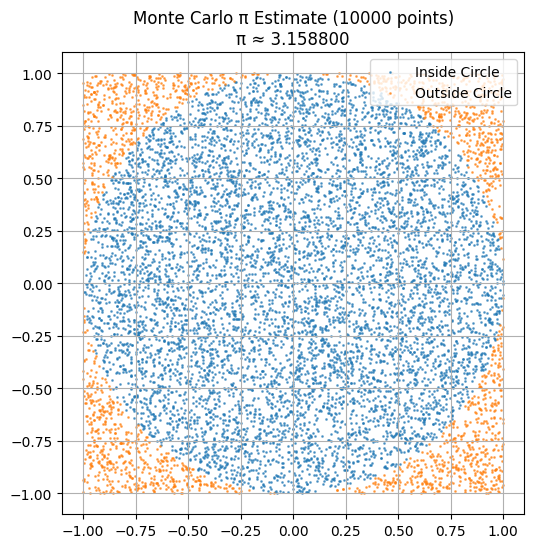
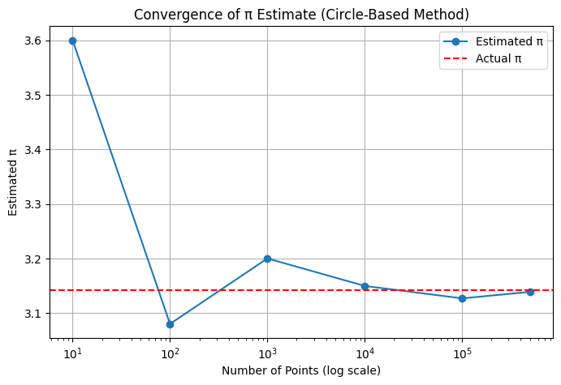
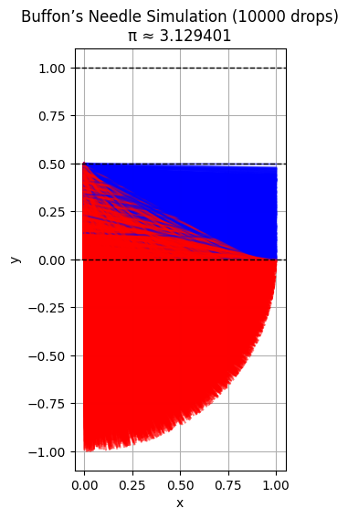
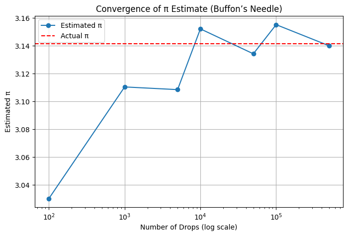

# Problem 2
# Monte Carlo Estimation of $\pi$

Monte Carlo simulations are a powerful way to estimate values using randomness. One of the most elegant examples is estimating $\pi$ through geometric probability. This project explores two classic methods: the **circle-based approach** and **Buffon’s Needle experiment**.

---

## 1. Circle-Based Method

### Theoretical Foundation

A unit circle is inscribed within a square of side length 2 (extending from -1 to 1 in both $x$ and $y$ directions). We randomly generate points inside the square and calculate the fraction that falls within the circle.

- Area of the square: $4$
- Area of the circle: $\pi$

The probability a point lands inside the circle is:

$$
P = \frac{\text{Area of circle}}{\text{Area of square}} = \frac{\pi}{4}
$$

Thus, $\pi$ can be estimated by:

$$
\pi \approx 4 \cdot \frac{\text{points inside the circle}}{\text{total points}}
$$

### Convergence Analysis

- This method has a convergence rate of $\mathcal{O}(1/\sqrt{n})$.
- To achieve approximately **2 correct decimal digits**, we typically need around **10,000 points**.
- Accuracy improves slowly: even with **1,000,000 points**, the estimate might only stabilize to **4 correct digits**.

### Visualization Notes

- Points are plotted with two colors: inside the circle (e.g., blue) and outside (e.g., red).
- The visual clearly illustrates how the density inside the circle relates to the estimate of $\pi$.
- A **convergence graph** ($\pi$ estimate vs number of points) shows how the estimate fluctuates and stabilizes with more samples.





---

## 2. Buffon’s Needle

### Theoretical Foundation

This classical probability problem involves dropping a needle of length $L$ on a plane with equally spaced parallel lines a distance $d$ apart (with $L \leq d$).

The probability the needle crosses a line is:

$$
P = \frac{2L}{\pi d}
$$

Rearranged to estimate $\pi$:

$$
\pi \approx \frac{2L \cdot N}{d \cdot C}
$$

Where:

- $N$ is the number of throws  
- $C$ is the number of crossings

### Convergence Analysis

- This method **converges even more slowly** than the circle-based method.
- The estimate is **highly variable**, especially when crossings are rare (e.g., short needle, few drops).
- Often requires **hundreds of thousands of throws** to produce a decent estimate.

Still, it's historically significant and a clever geometric trick to estimate $\pi$ **without geometry per se**.

### Visualization Notes

- The needle's position and orientation are shown relative to the lines.
- Needles that cross a line are colored differently (e.g., red), offering a clear visual of successful "hits".
- The visual offers **intuition into the randomness and rare event behavior** that drives this method.





---

## 3. Summary Comparison

| Method           | Accuracy per 10,000 samples | Convergence Rate       | Notes                                             |
|------------------|-----------------------------|------------------------|---------------------------------------------------|
| Circle-Based     | ≈ 2 decimal digits          | $\mathcal{O}(1/\sqrt{n})$ | Simple, stable, and easy to visualize             |
| Buffon’s Needle  | ≈ 1 digit or less           | Slower, high variance  | Elegant idea, but inefficient for estimation      |

## 4. Python Simulation
```python
import numpy as np
import matplotlib.pyplot as plt

# === Circle-Based Method ===

def estimate_pi_circle(num_points):
    x = np.random.uniform(-1, 1, num_points)
    y = np.random.uniform(-1, 1, num_points)
    inside = x**2 + y**2 <= 1
    pi_estimate = 4 * np.sum(inside) / num_points
    return pi_estimate, x, y, inside

def plot_circle(x, y, inside, num_points, pi_estimate):
    plt.figure(figsize=(6, 6))
    plt.scatter(x[inside], y[inside], s=1, label="Inside Circle", alpha=0.6)
    plt.scatter(x[~inside], y[~inside], s=1, label="Outside Circle", alpha=0.6)
    plt.gca().set_aspect('equal')
    plt.title(f"Monte Carlo π Estimate ({num_points} points)\nπ ≈ {pi_estimate:.6f}")
    plt.legend()
    plt.grid(True)
    plt.show()

def convergence_circle(trials):
    estimates = []
    for n in trials:
        pi_est, *_ = estimate_pi_circle(n)
        estimates.append(pi_est)
    
    plt.figure(figsize=(8, 5))
    plt.plot(trials, estimates, marker='o', linestyle='-', label="Estimated π")
    plt.axhline(np.pi, color='red', linestyle='--', label="Actual π")
    plt.xscale('log')
    plt.xlabel("Number of Points (log scale)")
    plt.ylabel("Estimated π")
    plt.title("Convergence of π Estimate (Circle-Based Method)")
    plt.legend()
    plt.grid(True)
    plt.show()

# === Buffon's Needle Method ===

def estimate_pi_buffon(throws, L=1.0, d=1.0):
    crossings = 0
    positions = []

    for _ in range(throws):
        y = np.random.uniform(0, d / 2)
        theta = np.random.uniform(0, np.pi / 2)
        if y <= (L / 2) * np.sin(theta):
            crossings += 1
        positions.append((y, theta))

    if crossings == 0:
        return None, positions
    pi_estimate = (2 * L * throws) / (d * crossings)
    return pi_estimate, positions

def plot_buffon(positions, pi_estimate, throws, L=1.0, d=1.0):
    plt.figure(figsize=(6, 6))
    for y, theta in positions:
        y1 = y
        y2 = y - L * np.sin(theta)
        x2 = L * np.cos(theta)
        color = 'red' if y2 <= 0 else 'blue'
        plt.plot([0, x2], [y1, y2], color=color, alpha=0.5)

    for i in range(3):
        plt.axhline(i * d / 2, color='black', linestyle='--', linewidth=1)

    plt.title(f"Buffon’s Needle Simulation ({throws} drops)\nπ ≈ {pi_estimate:.6f}")
    plt.gca().set_aspect('equal')
    plt.xlabel("x")
    plt.ylabel("y")
    plt.grid(True)
    plt.show()

def convergence_buffon(trials_list, L=1.0, d=1.0):
    estimates = []
    for n in trials_list:
        est, _ = estimate_pi_buffon(n, L, d)
        estimates.append(est if est else np.nan)

    plt.figure(figsize=(8, 5))
    plt.plot(trials_list, estimates, marker='o', linestyle='-', label="Estimated π")
    plt.axhline(np.pi, color='red', linestyle='--', label="Actual π")
    plt.xscale('log')
    plt.xlabel("Number of Drops (log scale)")
    plt.ylabel("Estimated π")
    plt.title("Convergence of π Estimate (Buffon’s Needle)")
    plt.legend()
    plt.grid(True)
    plt.show()

# === Example Usage ===

if __name__ == "__main__":
    # Circle-Based Simulation
    num_points = 10000
    pi_c, x, y, inside = estimate_pi_circle(num_points)
    plot_circle(x, y, inside, num_points, pi_c)

    # Circle-Based Convergence
    circle_trials = [10, 100, 1000, 10000, 100000, 500000]
    convergence_circle(circle_trials)

    # Buffon's Needle Simulation
    throws = 10000
    pi_b, positions = estimate_pi_buffon(throws)
    if pi_b:
        plot_buffon(positions, pi_b, throws)

    # Buffon's Needle Convergence
    buffon_trials = [100, 1000, 5000, 10000, 50000, 100000, 500000]
    convergence_buffon(buffon_trials)
```

## My Colab (Canliy961)

[Monte Carlo Method](https://colab.research.google.com/drive/13dwnTHx8kgy4O_amv0WyQMuZKYwJWa5I#scrollTo=WXglcEKziNq6)
