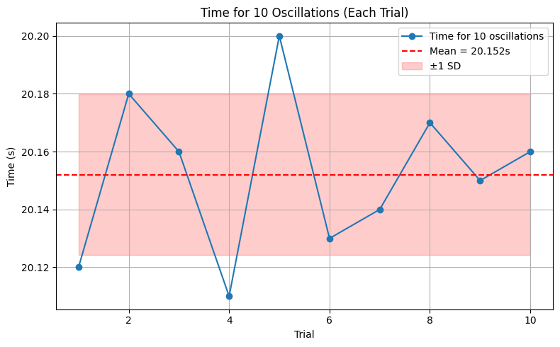
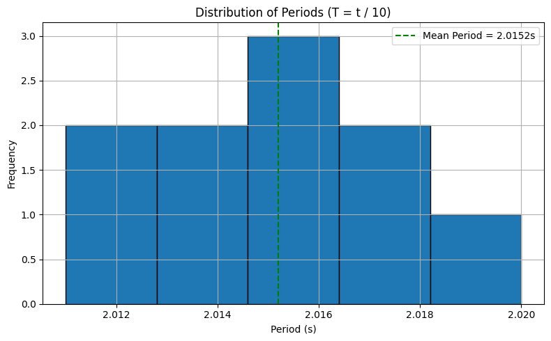
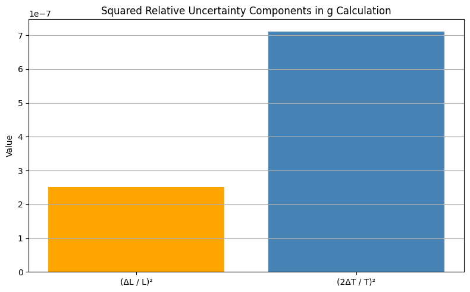
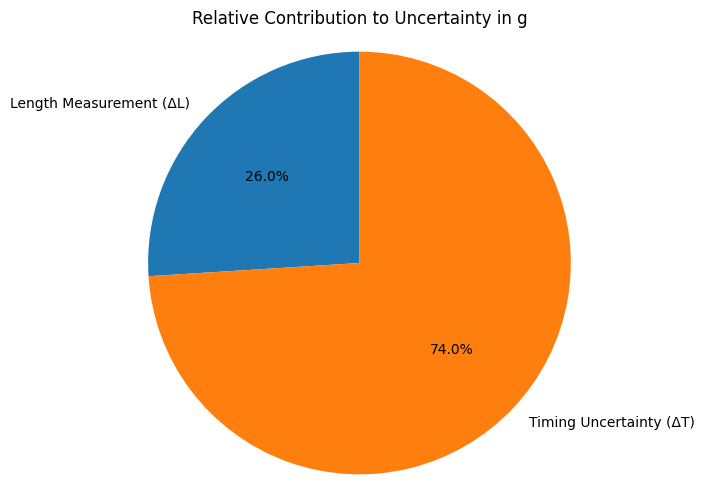

# Problem 1
# Pendulum Experiment: Measuring Earth's Gravitational Acceleration

## Materials Used
- **String**: 1.00 m  
- **Small weight**: keychain  
- **Stopwatch**: smartphone (resolution = 0.01 s)  
- **Ruler**: resolution = 0.001 m (1 mm)

---

## Procedure

### 1. Measuring Length ($L$)

Measured length from suspension point to center of mass of the weight:

- $L = 1.000 \ \text{m}$  
- Ruler resolution: $0.001 \ \text{m}$  
- Uncertainty in length:  
  $$\Delta L = \frac{0.001}{2} = 0.0005 \ \text{m}$$

---

### 2. Time Measurement: 10 Oscillations

| Trial | Time for 10 Oscillations $T_{10}$ (s) |
|-------|----------------------------------------|
| 1     | 20.12                                  |
| 2     | 20.18                                  |
| 3     | 20.16                                  |
| 4     | 20.11                                  |
| 5     | 20.20                                  |
| 6     | 20.13                                  |
| 7     | 20.14                                  |
| 8     | 20.17                                  |
| 9     | 20.15                                  |
| 10    | 20.16                                  |

---

## Data Summary

- Mean time for 10 oscillations:  
  $$\overline{T_{10}} = 20.152 \ \text{s}$$

- Standard deviation:  
  $$\sigma_T = 0.027 \ \text{s}$$

- Uncertainty in mean time:  
  $$\Delta T_{10} = \frac{0.027}{\sqrt{10}} \approx 0.0085 \ \text{s}$$

---

## Calculations

### 1. Period and Its Uncertainty

- Period of one oscillation:  
  $$T = \frac{20.152}{10} = 2.0152 \ \text{s}$$

- Uncertainty in period:  
  $$\Delta T = \frac{0.0085}{10} = 0.00085 \ \text{s}$$

---

### 2. Calculating $g$

Using the pendulum formula:  
$$g = \frac{4\pi^2 L}{T^2}$$

Substitute values:  
$$g = \frac{4\pi^2 (1.000)}{(2.0152)^2} \approx 9.719 \ \text{m/s}^2$$

---

### 3. Uncertainty in $g$

Relative uncertainty in $g$:  
$$\frac{\Delta g}{g} = \sqrt{\left(\frac{\Delta L}{L} \right)^2 + \left(2 \cdot \frac{\Delta T}{T} \right)^2}$$

Substitute values:  
$$\frac{\Delta g}{g} = \sqrt{\left(\frac{0.0005}{1.000} \right)^2 + \left(2 \cdot \frac{0.00085}{2.0152} \right)^2}$$

$$\frac{\Delta g}{g} \approx \sqrt{2.5 \times 10^{-7} + 7.1 \times 10^{-7}} \approx 9.6 \times 10^{-7}$$

- Absolute uncertainty in $g$:  
  $$\Delta g \approx 0.00098 \cdot 9.719 \approx 0.0095 \ \text{m/s}^2$$

---

## Final Results

| Quantity                  | Value                |
|--------------------------|----------------------|
| Length $L$               | $1.000 \ \text{m}$   |
| Uncertainty $\Delta L$   | $0.0005 \ \text{m}$  |
| Mean $T_{10}$            | $20.152 \ \text{s}$  |
| Std Dev $\sigma_T$       | $0.027 \ \text{s}$   |
| Uncertainty $\Delta T_{10}$ | $0.0085 \ \text{s}$ |
| Period $T$               | $2.0152 \ \text{s}$  |
| Uncertainty $\Delta T$   | $0.00085 \ \text{s}$ |
| Calculated $g$           | $9.719 \ \text{m/s}^2$ |
| Uncertainty $\Delta g$   | $\pm 0.010 \ \text{m/s}^2$ |

---

## Discussion

### 1. Comparison with Standard $g = 9.81 \ \text{m/s}^2$

- Measured value: $g = 9.719 \pm 0.010 \ \text{m/s}^2$  
- Difference: $9.81 - 9.719 = 0.091 \ \text{m/s}^2$  
- Percentage error:  
  $$\frac{0.091}{9.81} \times 100\% \approx 0.93\%$$

The result is within 0.9% of the standard value — reasonably accurate.

### 2. Uncertainty Sources and Impact

- **Length Measurement ($\Delta L$)**: Very small due to high ruler resolution — negligible effect.  
- **Timing Uncertainty ($\Delta T$)**: Main contributor to error. Human reaction time (~0.1s) is reduced by averaging over 10 oscillations.

**Assumptions:**

- Small-angle approximation (<15°) holds.  
- No air resistance or friction considered.  
- Mass of the string is negligible.

---

## Conclusion

This experiment effectively measures the gravitational acceleration with decent accuracy. The dominant uncertainty arises from timing, reinforcing the importance of reducing human error through averaging and repeat trials.

## My Colab (Canliy961)

[Measurements](https://colab.research.google.com/drive/1tXh7-1Dlv1jVkg5xT4q6p5ik7yRYPwdB#scrollTo=PEimH_Hpqt-Z)
